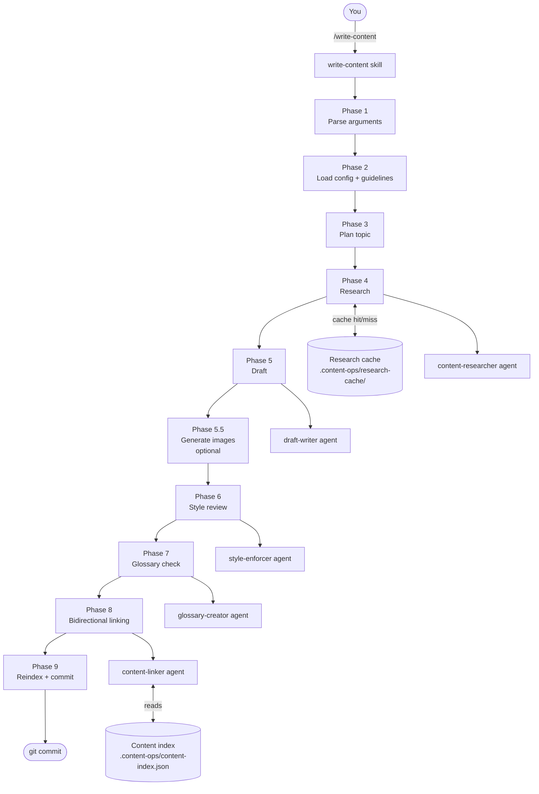

# content-ops

> **Work in progress.** The plugin works — but it's still being polished. Some defaults are borrowed from the project it was built on and aren't fully agnostic yet. Expect rough edges and active iteration. Follow progress on [LinkedIn](https://linkedin.com/in/pcamarajr).

A Claude Code plugin that gives you a team of AI writers running from your strategy — so you stay focused on what to build, not on writing every word.

You define your content pillars, goals, and style. content-ops handles research, writing, translation, internal linking, fact-checking, and indexing. You review, approve, and ship.

Works with any markdown-based static site (Astro, Next.js with Contentlayer, Hugo, and others) — if your content has frontmatter and a body, it should work.

---

## What it does

Instead of writing each article from scratch, you run a single command and get a research-backed, style-reviewed, internally-linked draft — ready for your review.

The typical workflow:

- Add ideas to a **backlog** as they come to you
- When ready, ask content-ops to pick from the backlog — or kick off an interactive session for something specific
- Claude researches, drafts, checks facts, enforces your style, links to related content, and updates your trackers
- You review the PR, iterate if needed, and ship

It's the same loop you'd run with a copywriter — but always available, always on-brief.

---

## Quick start

### 1. Install

Copy the plugin into your project:

```bash
cp -r content-ops/ your-project/.claude/plugins/content-ops
```

Or install via the Claude Code plugin marketplace:

```
/plugin marketplace add pcamarajr/content-stack
/plugin install content-ops@content-stack
```

### 2. Init

Run the setup wizard inside Claude Code:

```
/init
```

This walks you through six setup rounds: your author info and languages, content types and paths, style guide and reference articles, content strategy and pillars, infrastructure (backlog, trackers), and optionally image generation.

You can run rounds individually:

```
/init project
/init content-types
/init style
/init strategy
/init infra
/init images
```

### 3. Index your content

```
/reindex
```

Scans your existing content and builds `.content-ops/content-index.json` — the knowledge layer the agents use for linking and discovery.

### 4. Write something

```
/write-content article "Getting started with Docker"
/write-content backlog 3
/write-content
```

That's it. Claude takes it from there.

---

## How it works

content-ops is a **phase-based orchestrator**. When you run `/write-content`, it coordinates a pipeline of specialized agents — each focused on one job.



All knowledge lives in files — no embeddings, no vector DBs, no external APIs required for the core pipeline.

→ [Full technical walkthrough](./docs/how-it-works.md)

---

## Skills at a glance

| Skill | What you type | What happens |
|---|---|---|
| `/init` | `/init` or `/init [round]` | Setup wizard — creates config, guides, and trackers |
| `/write-content` | `/write-content article "Topic"` | Full pipeline: research → draft → style → link → commit |
| `/translate` | `/translate es` | Localize content to a target language |
| `/fact-check` | `/fact-check path/to/article.md` | Verify every claim against trusted sources |
| `/review-content` | `/review-content path/to/article.md` | Style, tone, structure, and linking audit |
| `/suggest-content` | `/suggest-content 5` | Suggest next articles from gaps in your strategy |
| `/reindex` | `/reindex` | Rebuild the content index from current files |

→ [Full skills reference](./docs/skills.md)

---

## Requirements

- [Claude Code](https://claude.ai/code) CLI
- Node.js 22+
- A markdown-based static site with frontmatter content

No API keys needed for the core workflow. Image generation is optional and uses Google Gemini or OpenAI when enabled.

---

## Documentation

| | |
|---|---|
| [How it works](./docs/how-it-works.md) | Architecture, agent pipeline, phase breakdown |
| [Configuration](./docs/configuration.md) | Full config schema and `.content-ops/` layout |
| [Skills](./docs/skills.md) | Every skill with examples and options |
| [Agents](./docs/agents.md) | What each agent does and when it runs |
| [Knowledge layer](./docs/knowledge-layer.md) | Content index, research cache, and how linking works |

---

## Status

This plugin is **actively being developed**. Current state:

- **Works:** init wizard, write-content pipeline, translation, fact-check, review, suggest, reindex, internal linking, research cache
- **In progress:** removing project-specific assumptions to make it fully framework-agnostic
- **Not yet:** automation / CI mode, public examples, full test coverage

Feedback and issues welcome on [GitHub](https://github.com/pcamarajr/content-stack/issues).

---

## License

MIT — by [Pedro Camara Jr](https://linkedin.com/in/pcamarajr)
