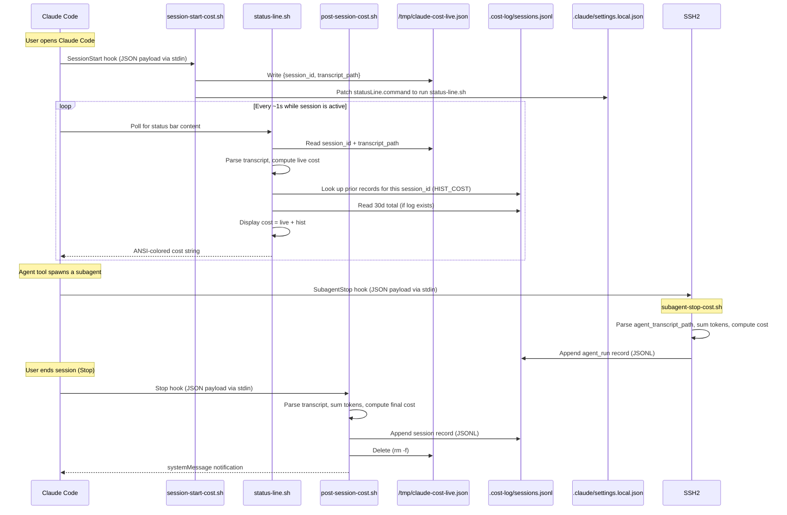
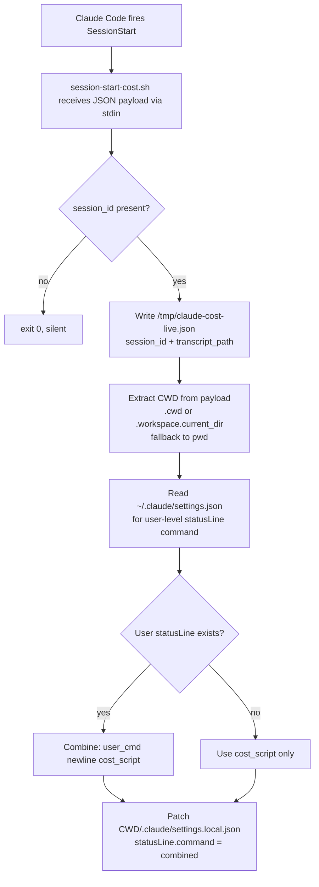
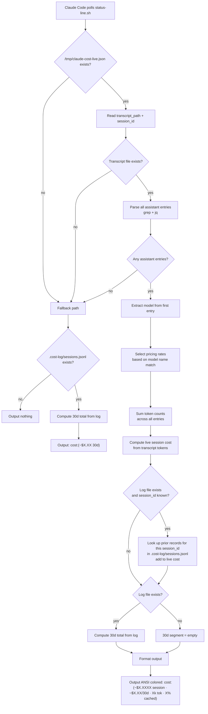
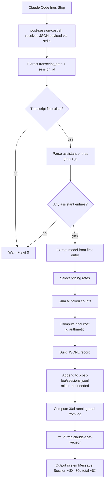

# cost-tracker — Architecture Reference

> Current as of v0.3.0 (2026-03-21). Documents the existing implementation.

---

## Overview

cost-tracker is a Claude Code plugin that tracks token usage and estimated API cost per session. It operates entirely through shell scripts, with no server or daemon — all logic runs inline in hooks and a status-bar polling script.

Three concerns drive the design:

- **Session capture** — intercept the start and end of every Claude Code session to record cost data
- **Live display** — show a running cost counter in the status bar while the session is active
- **Persistence** — write completed sessions to a per-project log file for later reporting

---

## Component Map

```
cost-tracker/
├── hooks/hooks.json                        ← hook registrations (SessionStart, Stop, SubagentStop)
├── hooks-handlers/
│   ├── session-start-cost.sh               ← SessionStart handler
│   ├── post-session-cost.sh                ← Stop handler
│   └── subagent-stop-cost.sh              ← SubagentStop handler
├── scripts/
│   ├── status-line.sh                      ← status bar renderer (polled by Claude Code)
│   └── report.sh                           ← on-demand analytics
└── skills/
    └── report/SKILL.md                     ← /cost-tracker:report skill definition
```

**External data stores**

| Path | Scope | Purpose |
|---|---|---|
| `/tmp/claude-cost-live.json` | Machine, ephemeral | Bridges SessionStart → status-line.sh |
| `<project>/.cost-log/sessions.jsonl` | Project, persistent | One record per completed session |
| `<project>/.claude/settings.local.json` | Project, persistent | Patched at SessionStart to inject statusLine |

---

## Session Lifecycle



---

## Data Flow: SessionStart



---

## Data Flow: Status Bar (Polling)



---

## Data Flow: Stop Hook



---

## Pricing Logic

Pricing is embedded inline in two scripts: `post-session-cost.sh` and `status-line.sh`. Both produce the same rates but use slightly different control flow:

- `post-session-cost.sh` uses `if / elif / else` — Sonnet rates appear only in the `else` fallback branch, and sets `PRICING="estimated"` for unknown models.
- `status-line.sh` pre-assigns Sonnet rates as unconditional defaults, then only `if / elif` for Opus and Haiku. Sonnet models therefore fall through without entering any branch. `PRICING` is never set here — the status bar script does not write log records.

Both apply the same formula:

```
cost = (input_tokens × in_rate
      + output_tokens × out_rate
      + cache_write_tokens × cw_rate
      + cache_read_tokens × cr_rate) / 1_000_000
```

**Pricing table (USD per 1M tokens)**

| Model match | Input | Output | Cache write | Cache read | Pricing flag |
|---|---|---|---|---|---|
| `claude-opus-4*` | $15.00 | $75.00 | $18.75 | $1.50 | `standard` |
| `claude-sonnet-4*` | $3.00 | $15.00 | $3.75 | $0.30 | `standard` |
| `claude-haiku-4*` | $0.80 | $4.00 | $1.00 | $0.08 | `standard` |
| _(no match)_ | $3.00 | $15.00 | $3.75 | $0.30 | `estimated` |

The `pricing` field in the JSONL record distinguishes confirmed from estimated rates. Only `post-session-cost.sh` sets this field; `status-line.sh` never writes log records.

---

## Log Record Schema

`.cost-log/sessions.jsonl` is newline-delimited JSON (JSONL); each record is independent and the log is append-only. `cost_usd` is rounded to 5 decimal places (`* 100000 | round / 100000`). `report.sh` skips malformed lines rather than failing.

**Session record** (written by `post-session-cost.sh` via the `Stop` hook):

```json
{
  "session_id":         "abc123",
  "timestamp":          "2026-03-18T14:22:00Z",
  "model":              "claude-sonnet-4-6",
  "input_tokens":       12000,
  "output_tokens":      800,
  "cache_write_tokens": 3000,
  "cache_read_tokens":  45000,
  "cost_usd":           0.04320,
  "pricing":            "standard"
}
```

Session records have no `record_type` field; `report.sh` treats any record without `record_type` (or with `record_type != "agent_run"`) as a session record.

**Agent run record** (written by `subagent-stop-cost.sh` via the `SubagentStop` hook):

```json
{
  "record_type":        "agent_run",
  "session_id":         "abc123",
  "agent_id":           "xyz789",
  "timestamp":          "2026-03-18T14:23:10Z",
  "model":              "claude-sonnet-4-6",
  "input_tokens":       5000,
  "output_tokens":      300,
  "cache_write_tokens": 1000,
  "cache_read_tokens":  15000,
  "cost_usd":           0.01200,
  "pricing":            "standard"
}
```

---

## Status Bar Output Examples

**During an active session:**
```
cost:(~$0.0432 session · ~$1.24/30d · 30k tok · 78% cached)
```
Rendered with ANSI color: `cost:` label in green, values in white.

**Between sessions (no active session):**
```
cost:(~$1.24 30d)
```

**Combined with a user statusLine** (set in `~/.claude/settings.json`):
```
main ✓ 3 files changed
cost:(~$0.0432 session · ~$1.24/30d · 30k tok · 78% cached)
```
The SessionStart handler wraps both into a single `bash -c '...'` expression so Claude Code sees one statusLine command that outputs two lines. The 30d segment is always present whenever `.cost-log/sessions.jsonl` exists, regardless of whether a user statusLine is combined.

---

## Known Limitations and Rough Edges

| Area | Issue |
|---|---|
| Pricing duplication | The pricing table and token-summing logic are copied verbatim between `post-session-cost.sh`, `subagent-stop-cost.sh`, and `status-line.sh`. A change to rates requires editing three files. |
| `settings.local.json` mutation | SessionStart overwrites `statusLine` in the local settings file on every start. If another tool also writes to that key, they will clobber each other. |
| No session isolation | `/tmp/claude-cost-live.json` is a single file. If two Claude Code sessions are open simultaneously, the second SessionStart overwrites the first session's live state. |
| Transcript parsing fragility | The transcript is read with `grep -o '{.*}'` (greedy match) rather than a proper JSONL parser. Lines with nested JSON objects could match incorrectly. |
| Date calculation portability | The `date -v-Xd` (BSD) / `date -d "X days ago"` (GNU) dual-path adds noise to every script. |
| Haiku 4 pricing placeholder | The Haiku 4 rate is based on Haiku 3.5 — marked in README but not in code. |
